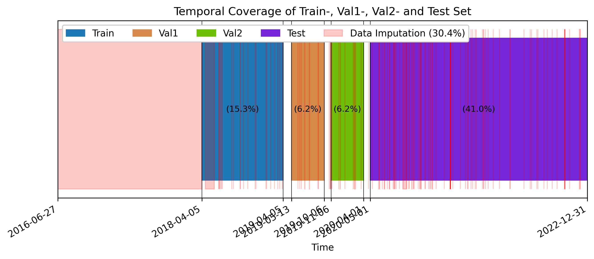
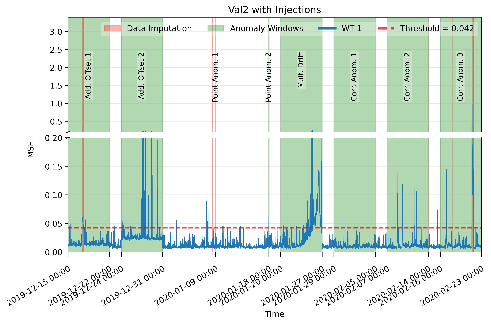
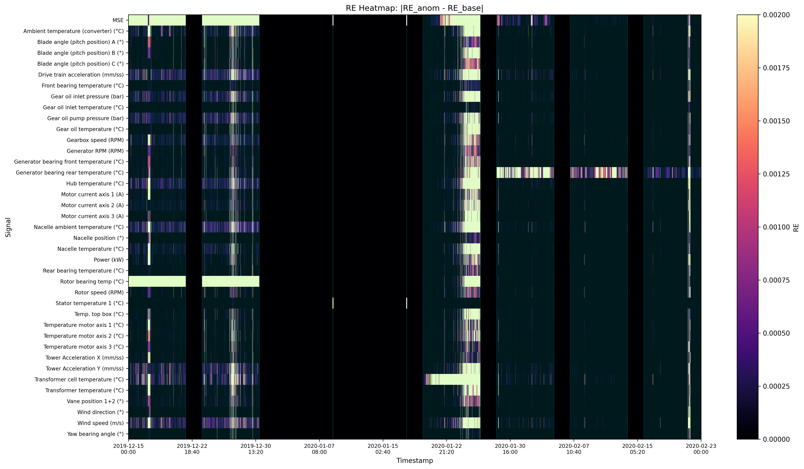
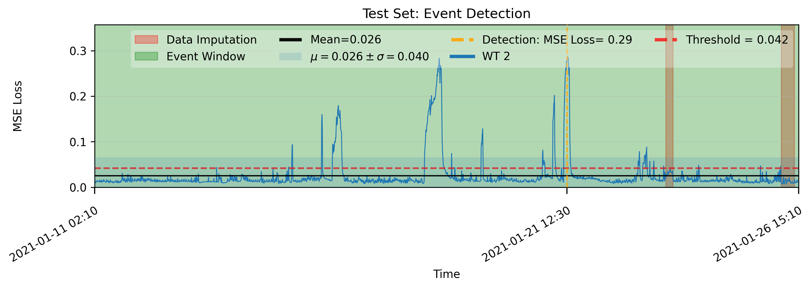
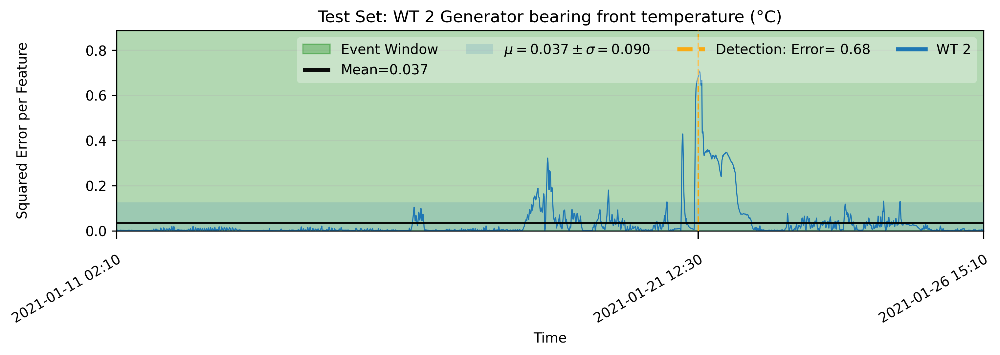
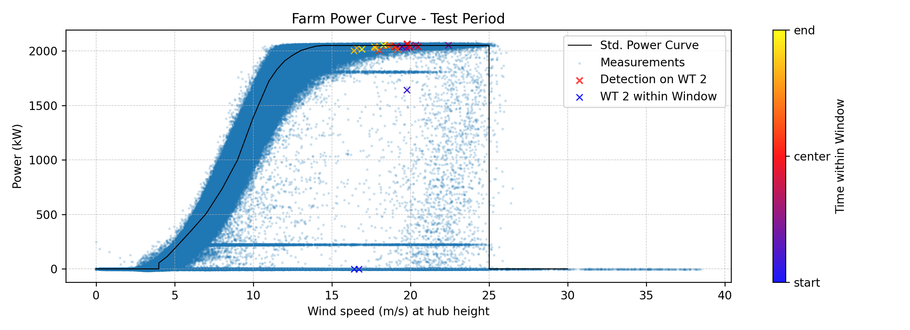
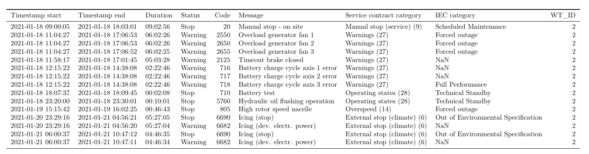
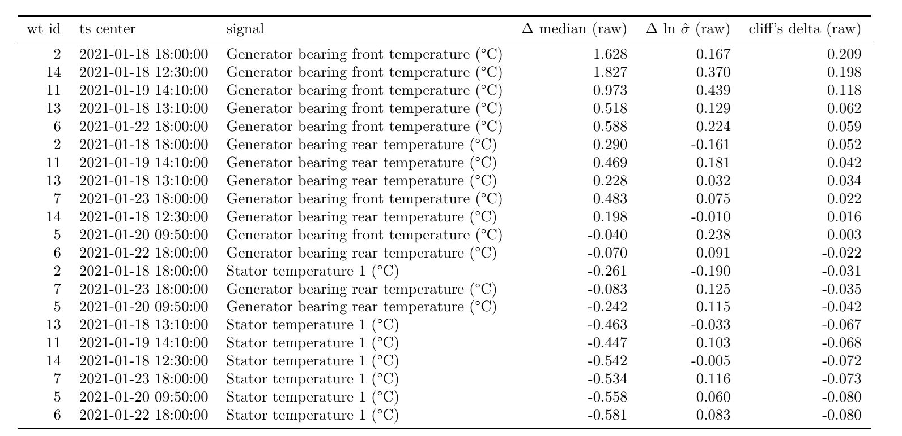

# Autoencoder-based Anomaly Detection in Open Wind Turbine SCADA Datasets
This work explores the AE's reconstruction error response to selected synthetic anomalies in a controlled environment. In addition, for anomaly detection, the open-source SCADA Penmanshiel dataset is investigated.


# Installation Guide
Option 1: 
```bash
use pip install -e .
```
Option 2 (recommended): 
Creates own venv...
```bash
python -m pip install pdm
python -m pdm install
```

The package torch needs to be installed manually.

The installation should work on win11 and linux. 
It may happen that on macOS the internal package importing is faulty. In this case you need to adjust the imports manually -> check the root folder and relative folder expressions.

# Requirements
Make sure you have enough disk space available. 50gb should be enough. 
## Acquire the Penmanshiel Dataset and get further Informations 
Please visit https://github.com/sltzgs/OpenWindSCADA (recommended) 
or directly https://zenodo.org/records/5946808

- Instructions for the data are in the notebook step_1_preprocessing.ipynb

# Jupyter Notebooks
You need to run and the notebooks in the exact ordering as shown in the main folder.
There is also more content in the folder further_content.
After the last preprocessing step, you can delete the old .csv files and keep only the last versions in order to free disk space.

# Notes
In the implementation, there exist several functions and code fragments that are not used anymore (dead). 

# Troubleshooting - Replication of Results
- After you complete the preprocessing, you may run the notebook  "further_content/new_pc_filtering.ipynb" in case of inconsistencies in power curve filtering. It will update the power curve filtering.
- It may be possible that the seeding for deterministic behavior on GPU processing is limited. Try to re-run the training a couple times to get the expected results. If it did not succeed, then use the device CPU.
<br><br><br><br>


# Project Content
For more details on this project, ask me to get the thesis.
## Preprocessing
The preprocessing was divided into 5 steps. It comprised data aggregation (step 1,2), signal selection (step 2), data imputation (step 4), train set construction (step 5).

For the train set construction, we incorporated the fleet median, power curve cleaning and min-max scaling.

---
- X. Chesterman, T. Verstraeten, P.-J. Daems, A. Nowé, and J. Helsen, “Overview of normal
behavior modeling approaches for SCADA-based wind turbine condition monitoring demon-
strated on data from operational wind farms,” Wind Energy Sci., vol. 8, no. 6, pp. 893–924,
2023, doi: 10.5194/wes-8-893-2023.

- R. Morrison, X. Liu, and Z. Lin, “Anomaly detection in wind turbine SCADA data for power
curve cleaning,” Renewable Energy, vol. 184, pp. 473–486, 2022, doi: 10.1016/j.renene.
2021.11.118.
<br><br><br>


## Architectural Choices
Linear -> BatchNorm -> Dropout -> Activation
## Hyperparameter Tuning
The tuning parameters were:
- Model: Layer Tuning
- Learning rate (AdamW)
- Batch Size
- Dropout value
- Weight Decay
- Activation (ReLU and Leaky ReLU)

According to limited hardware resources, the hyperparameter tuning was simplified.
The hyperparameter tuning was an 8-stage process and can be characterized as a greedy search.
## Loss Function
The MSE was selected as a loss function.
## Model Training
Model training was applied with early stopping.

## Controlled Environment and Threshold Calibration
In this part of this work, we investigated the error response of the autoencoder to specific synthetic anomalies. The implemented synthetic anomalies were additive Offset ("Rotor bearing temp
(°C)), point anomaly ("Stator temperature 1 (°C)), multiplicative drift (Transformer cell temperature (°C)) and correlation-based anomaly (Generator bearing rear temperature (°C), "Generator bearing front temperature (°C)).

For simplicity we have chosen a global threshold for the signals. The calibration of the threshold was a semi-automatic process. The threshold was defined as $\tau(k) := \hat\mu + k \cdot \hat\sigma$.


*Temporal course of MSE of injected anomalies*


*The range of the REs was cut off to make smaller REs visible. The max. RE was set to the threshold value. The
original range of REs was from 0 to ≈ 4*

## Exploratory Case Study on the Penmanshiel Dataset


.png)

*Event detection and temporal course of RE globally and signal specific
The time window for the power curve was ±2 hours around the detection.*

_plus_wind_nacelle.png)
.png)
.png)
*Generator related raw signals, nacelle alignment and power output around the detection
time*


*Status logs: The table is showing the stop and warning messages in a 6 day time window centered on the detection time.*


*Long-term and farm-wide statistical comparison of thermal signals: The employed window size for pre- and post samples were maximal 300 days.
Ts center denotes the timestamp of the end of the maintenance.*

According to the status logs, only overload generator fan warning messages were found. No other information related to the generator was found in the logs in a time window of ±30 days around the detection time.

A farm-wide screening revealed that in the time period from 2021-01-18 12:30 to 2021-01-24 09:30
of the same year, there were also partial maintenance activities with similar thermal deviation
patterns in the generator bearing temperatures. The identified wind turbines were 5, 6, 7, 11,
13, and 14. Each of these wind turbines underwent maintenance prior to the signal shift of the
generator bearing front temperature. 

We hypothesize that the observed
detection event of WT 2 reflects a thermally unfavorable change in generator-bearing-related
operation conditions. It is potentially associated with maintenance or a subsequent reconfiguration
of the generator cooling system. It is less likely that the detection event represents a single-turbine
fault. The potentially changed cooling dynamics of the generator, including the bearing front,
are likely unfavorable because they caused temporally higher temperatures up to ≈ 70◦ , which
could change the viscosity of the lubricant and eventually accelerate the lubricant degradation and
bearing wear.